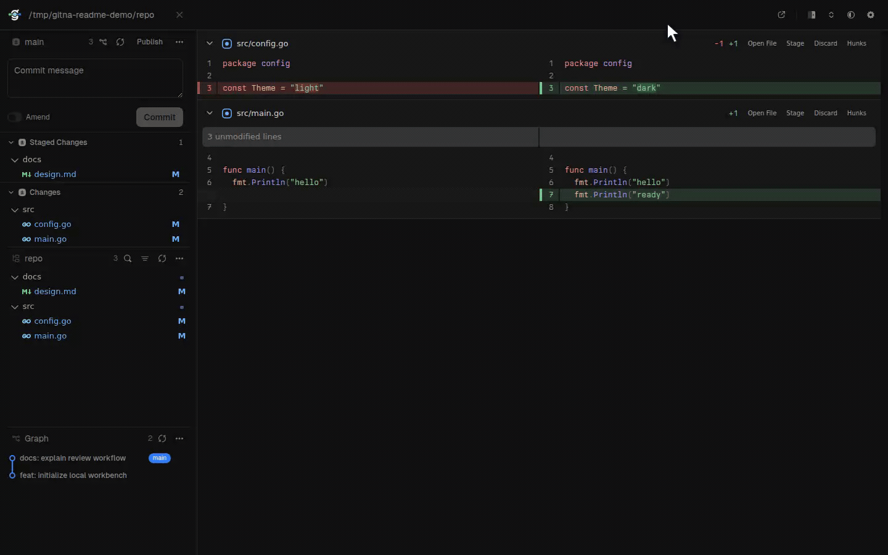

<p align="center">
  
</p>

<h1 align="center">Gitna</h1>

<p align="center">A local Git workbench that runs in your browser.</p>

<p align="center">
  <a href="https://www.npmjs.com/package/gitna"></a>
  <a href="https://github.com/roie/gitna/actions/workflows/ci.yml"></a>
  <a href="LICENSE"></a>
</p>

Gitna brings source control, visual diffs, repository history, and everyday Git operations into one focused interface. It runs on your machine, uses your installed Git, and keeps repository data local.



> [!WARNING]
> Gitna is in early development. Expect bugs, rough edges, and breaking changes.

## Quick start

Install with npm:

```sh
npm install -g gitna
```

Open any Git repository:

```sh
cd your-repository
gitna
```

Gitna starts a local server and opens an authenticated session in your default browser. You can also pass a repository or subdirectory explicitly:

```sh
gitna /path/to/repository
```

## What you can do

- Review staged and unstaged changes with Pierre-powered split or unified diffs
- Preview PNG, JPEG, WebP, and GIF changes alongside text diffs
- Browse and edit working-tree files in repository tabs
- Stage and unstage files, folders, or individual hunks
- Commit and amend while preserving normal Git hook behavior
- Browse branches, tags, stashes, and commit history
- Fetch, pull, push, compare, merge, rebase, cherry-pick, and revert
- Resolve conflicts with explicit ours, theirs, or combined content
- Switch between local repositories without restarting Gitna

## Install

### npm

```sh
npm install -g gitna
```

The single npm package downloads the matching native binary from GitHub Releases, verifies its SHA-256 checksum, and caches it locally. Node.js is required only for npm installations.

### mise

```sh
mise use -g github:roie/gitna
```

Mise installs the native GitHub Release asset directly; Node.js is not required at runtime.

### Direct download

Download the archive for your platform from [GitHub Releases](https://github.com/roie/gitna/releases), extract it, and place `gitna` (`gitna.exe` on Windows) on your `PATH`.

Supported release targets:

- Linux x64
- Linux arm64
- Windows x64
- WSL using the Linux binary and your normal Windows browser

Gitna requires an installed `git` executable and a modern browser.

## Local by design

Gitna binds only to a random loopback port. Every process creates a high-entropy capability URL, and mutating requests are protected by Host, Origin, content-type, and size checks.

Repository reads and mutations go through the system Git executable. Gitna does not upload repository data or replace Git's storage, configuration, credentials, or hooks.

See [SECURITY.md](SECURITY.md) for the complete security model and vulnerability reporting instructions.

## Development

Development setup, validation commands, packaging, and release instructions are documented in [CONTRIBUTING.md](CONTRIBUTING.md).

## License

Gitna is licensed under [Apache-2.0](LICENSE). Bundled dependency notices are available in [THIRD_PARTY_NOTICES.md](THIRD_PARTY_NOTICES.md) and [THIRD_PARTY_LICENSES.txt](THIRD_PARTY_LICENSES.txt).
